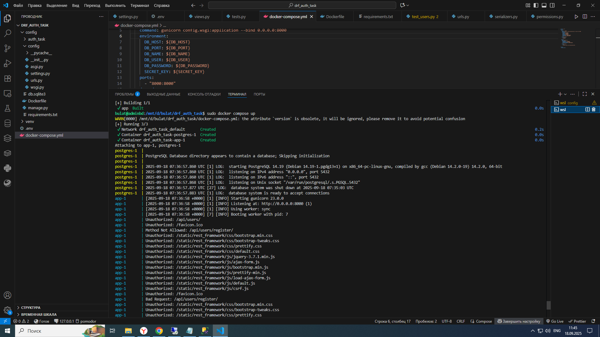
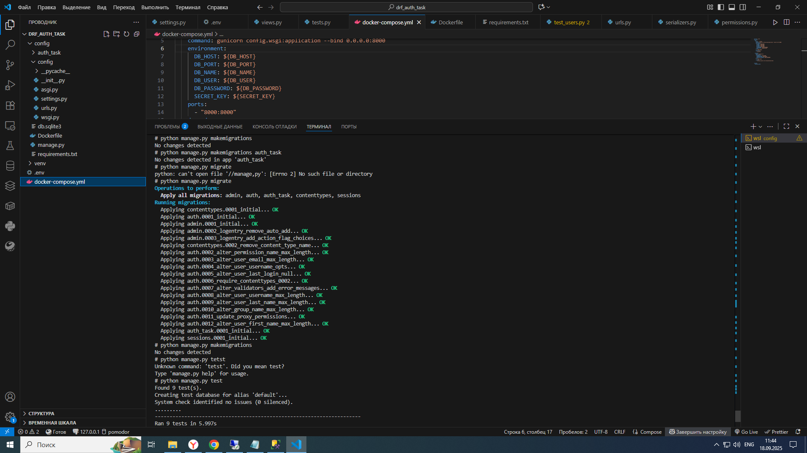

# Система аутентификации и авторизации на Django DRF
## Описание проекта
Это тестовое задание по реализации собственной системы аутентификации и авторизации на Django REST Framework. Система предоставляет полный цикл управления пользователями и разграничения прав доступа к ресурсам.

### Основные возможности
1. Управление пользователями
Регистрация новых пользователей

Аутентификация по email и паролю

Обновление профиля пользователя

Мягкое удаление аккаунта (deactivation)

Выход из системы

2. Система разграничения прав доступа
Ролевая модель доступа

Гибкая система разрешений для различных бизнес-элементов

Проверка прав доступа на уровне middleware и permissions

Возврат соответствующих HTTP-статусов (401, 403)

3. Mock-ресурсы
Демонстрационные эндпоинты для тестирования системы доступа

Примеры бизнес-объектов с проверкой прав доступа

### Технологический стек
Python 3.9+

Django 4.2+

Django REST Framework 3.14+

PostgreSQL (рекомендуется) или SQLite

JWT для аутентификации

bcrypt для хеширования паролей

Установка и запуск
Клонируйте репозиторий:

```
git clone https://github.com/bulat-nitaliev/custom_auth_task_drf.git
cd custom_auth_task_drf
```
Создайте и активируйте виртуальное окружение:

```
python -m venv venv
source venv/bin/activate  # Linux/MacOS
# или
venv\Scripts\activate  # Windows
```
Установите зависимости:

```
pip install -r requirements.txt
```
Настройте базу данных в config/settings.py:

python
```
DATABASES = {
    'default': {
        'ENGINE': 'django.db.backends.postgresql',
        'NAME': 'your_db_name',
        'USER': 'your_db_user',
        'PASSWORD': 'your_db_password',
        'HOST': 'localhost',
        'PORT': '5432',
    }
}
```
Выполните миграции:

```
python manage.py migrate
```
Загрузите тестовые данные:

```
python manage.py loaddata initial_data.json
```
Запустите сервер:

```
python manage.py runserver
```
### API Endpoints
### Аутентификация и пользователи
POST /api/users/register/ - Регистрация нового пользователя

POST /api/users/login/ - Вход в систему

POST /api/users/logout/ - Выход из системы

GET /api/users/{id}/ - Получение информации о пользователе

PATCH /api/users/{id}/ - Обновление информации о пользователе

DELETE /api/users/{id}/ - Удаление пользователя (деактивация)

### Mock-ресурсы
GET /api/mock-data/ - Получение списка mock-объектов

GET /api/mock-data/{id}/ - Получение конкретного mock-объекта

POST /api/mock-data/ - Создание нового mock-объекта

### Примеры запросов
### Регистрация пользователя
```
curl -X POST http://localhost:8000/api/users/register/ \
  -H "Content-Type: application/json" \
  -d '{
    "email": "user@example.com",
    "first_name": "John",
    "last_name": "Doe",
    "patronymic": "Smith",
    "password": "securepassword123",
    "password_confirm": "securepassword123"
  }'
  ```
### Вход в систему
```
curl -X POST http://localhost:8000/api/users/login/ \
  -H "Content-Type: application/json" \
  -d '{
    "email": "user@example.com",
    "password": "securepassword123"
  }'
  ```
### Доступ к защищенному ресурсу
```
curl -X GET http://localhost:8000/api/mock-data/ \
  -H "Authorization: Bearer <your_jwt_token>"
   ```
### Структура базы данных
Основные таблицы
#### User - Пользователи системы

email (уникальный)

first_name, last_name, patronymic

password (хешированный с bcrypt)

is_active (флаг активности)

role (внешний ключ к Role)

#### Role - Роли пользователей

name (уникальное название)

description

BusinessElement - Бизнес-элементы системы

name (уникальное название)

description

AccessRule - Правила доступа

role (внешний ключ)

element (внешний ключ)

read_permission, read_all_permission

create_permission

update_permission, update_all_permission

delete_permission, delete_all_permission

### Система разрешений
Система использует комбинацию ролей и правил доступа для определения прав пользователя:

Аутентификация - Middleware проверяет JWT-токен и идентифицирует пользователя

Авторизация - Permission класс проверяет права пользователя на выполнение действия

Обработка запроса - Если права подтверждены, запрос выполняется

HTTP-статусы
200 OK - Успешный запрос

201 Created - Успешное создание

400 Bad Request - Неверные данные запроса

401 Unauthorized - Пользователь не аутентифицирован

403 Forbidden - Пользователь аутентифицирован, но не имеет прав

404 Not Found - Ресурс не найден

### Тестирование
Для запуска тестов выполните:

```
python manage.py test
```
### Тесты покрывают:

Регистрацию и аутентификацию пользователей

Проверку прав доступа для различных ролей

Обработку ошибок аутентификации и авторизации

Работу с пользовательскими профилями

### Дополнительная информация
#### Безопасность
Пароли хешируются с использованием bcrypt

Аутентификация через JWT-токены с ограниченным временем жизни

Защита от основных уязвимостей (CSRF, XSS, SQL-инъекции)

### Расширение системы
Система легко расширяется добавлением новых:

Бизнес-элементов в модель BusinessElement

Правил доступа в модель AccessRule

Ролей в модель Role

### Кастомизация
Все компоненты системы (аутентификация, авторизация, middleware) реализованы кастомно и могут быть легко изменены под конкретные требования проекта.



